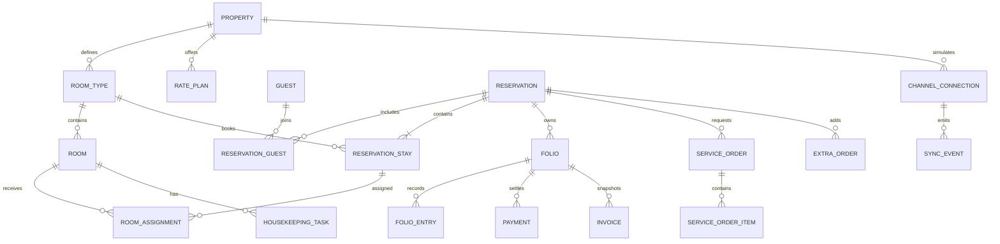

# Velora Database Schema

## 1. Data architecture

Recommended source of truth: PostgreSQL. IDs are UUIDv7 (or time-sortable UUID), timestamps are `timestamptz` in UTC, operational dates are `date` interpreted in the property IANA timezone, and money is integer minor units with a 3-letter currency code.

Every property-owned table includes `property_id`; authorization filters it server-side. Mutable operational records include `version integer`, `created_at`, `updated_at`. Soft deletion is limited to catalog/configuration records; reservations, ledger entries, invoices, audit events, and sync events are retained/voided rather than deleted.

## 2. Domain overview



## 3. Identity, tenancy, and audit

### `properties`

`id`, `code unique`, `name`, `slug unique`, `timezone`, `default_currency`, `locale`, `check_in_time`, `check_out_time`, `no_show_cutoff`, `tax_registration`, `address_json`, `contact_json`, `is_demo`, timestamps.

### `staff_users`, `roles`, `permissions`, `staff_memberships`, `role_permissions`

- User: identity provider subject, email, display name, active/session metadata.
- Membership: `(user_id, property_id, role_id)` unique.
- Permission examples: `reservation.write`, `rate.override`, `checkin.force`, `checkout.force`, `folio.adjust`, `payment.refund`, `room.oos`, `channel.retry`, `settings.write`, `demo.reset`.

### `audit_events`

Append-only: `id`, `property_id`, `actor_type` (`guest|staff|system|channel`), `actor_id`, `action`, `entity_type`, `entity_id`, `request_id`, `reason`, `before_json`, `after_json`, `ip_hash`, `occurred_at`. Partition by month if needed. Database role denies update/delete.

### `idempotency_keys`

`scope`, `key`, `request_hash`, `status`, `response_code`, `response_json`, `resource_type`, `resource_id`, `expires_at`; unique `(scope,key)`. Same key with different request hash is rejected.

## 4. Inventory and rates

### `room_types`

`id`, `property_id`, `code`, `slug`, `name`, `description`, `max_adults`, `max_children`, `max_occupancy`, `bed_json`, `size_m2`, `amenities_json`, `accessibility_json`, `media_json`, `active`, display order; unique `(property_id, code)` and `(property_id, slug)`.

### `rooms`

`id`, `property_id`, `room_type_id`, `number`, `floor`, `features_json`, `occupancy_status` (`vacant|occupied`), `condition_status` (`dirty|cleaning|clean|inspected`), `privacy_status` (`none|dnd`), `active`; unique `(property_id, number)`.

### `room_status_events`

Append-only transition log: room, dimension, from/to, reservation/task, actor, reason, occurred time.

### `room_blocks`

`id`, `property_id`, `room_id`, `kind` (`out_of_service|owner_block|courtesy_block`), `stay_range daterange`, `reason`, `owner_user_id`, `status`, start/release metadata. Exclusion prevents overlapping active blocks for the same room. Out-of-service and owner blocks remove inventory; courtesy block behavior is explicit configuration.

### `rate_plans`, `daily_rates`, `inventory_controls`

- Rate plan: code/name, meal/inclusions, payment/cancellation policy JSON, minimum/maximum stay, occupancy rules, active.
- Daily rate: `(property_id, room_type_id, rate_plan_id, stay_date)` unique, base minor amount, currency, restrictions (`closed`, CTA/CTD, min/max stay).
- Inventory control: `(property_id, room_type_id, stay_date)` unique, sell limit/overbooking limit/stop sell.

### `availability_counters` (optional performance projection)

Per property/type/date: physical active, blocked, committed, held, remaining, recalculated timestamp. This is a projection, never the only authority; reconciliation compares it to source rows.

## 5. Guests, reservations, and assignment

### `guests`

`id`, `property_id`, normalized email/phone, names, preferred name/pronouns, locale, address JSON, preferences JSON, accessibility_requests_encrypted, marketing consent fields, privacy retention date. Duplicate hints use normalized contact, but merges are explicit and audited.

### `reservations`

`id`, `property_id`, human `confirmation_number`, `status`, `source`, `source_detail`, `external_reservation_id`, `booker_guest_id`, `primary_guest_id`, arrival/departure dates, adults/children, currency, quote snapshot JSON, policy snapshot JSON, special requests, ETA, actual check-in/out, cancellation/no-show fields, version. Unique confirmation per property; unique partial `(property_id, source, external_reservation_id)` where external ID exists.

### `reservation_stays`

Supports multi-room and split stays: `id`, `reservation_id`, `room_type_id`, `rate_plan_id`, `stay_range daterange`, occupants, nightly price snapshot JSON, status. Constraint: nonempty `[)` date range and children/adults within chosen room-type rules at write time.

### `reservation_guests`

`reservation_id`, `guest_id`, `reservation_stay_id nullable`, `role` (`booker|primary|staying`), registration status; unique appropriate keys.

### `booking_drafts`, `quotes`, `inventory_holds`

- Draft: opaque ID, search/request JSON, step data encrypted, status, expires time, completed reservation.
- Quote: room/rate/extras/policy/tax snapshots, total, currency, expires time, hash.
- Hold: property/type, stay range, quantity, draft/reservation reference, status, expires time. Expired holds are ignored/reaped.

### `room_assignments`

`id`, `property_id`, `reservation_stay_id`, `room_id`, `stay_range daterange`, `status` (`active|released`), `locked`, assigned/released by/time, version.

Critical PostgreSQL guard (conceptual migration):

```sql
CREATE EXTENSION IF NOT EXISTS btree_gist;

ALTER TABLE room_assignments
ADD CONSTRAINT no_overlapping_active_room_assignments
EXCLUDE USING gist (
  property_id WITH =,
  room_id WITH =,
  stay_range WITH &&
)
WHERE (status = 'active');
```

Room-type capacity still requires a serializable transaction or advisory/row locks over each `(property_id, room_type_id, stay_date)` before inserting/updating a committed stay. The assignment exclusion constraint alone cannot prevent overselling unassigned type inventory.

### `reservation_events`, `notes`, `tasks`, `guest_access_tokens`

- Reservation events are append-only lifecycle/history records.
- Notes have visibility (`internal|guest_visible`), category, author, archived status; no silent edits after archive.
- Tasks link entity, assignee, priority, due/SLA, state, resolution.
- Guest tokens store hash, reservation, purpose, expiry, used/revoked times; never store or log raw token.

## 6. Housekeeping

### `housekeeping_tasks`

`id`, property/room/reservation, `service_type` (`departure|stayover|touch_up|inspection|deep_clean`), `status` (`open|assigned|in_progress|clean_complete|inspection_required|completed|deferred|cancelled`), condition before/after, priority, assignee, scheduled/due/started/completed/inspected times, DND attempts, rejection reason, notes, version.

Rules:

- exactly one open departure task per checkout/room;
- completion transition and room condition update occur in one transaction;
- only supervisor permission may approve/reject inspection;
- DND records an event and next attempt; it never masquerades as completion;
- out-of-service creation is a room block, not a housekeeping condition.

## 7. Catalogs, extras, and service orders

### `catalog_items`

Shared product definition: property, catalog (`extra|minibar|room_service`), SKU, name, description, fulfillment mode, unit minor price, currency, tax class, availability window, capacity/stock, dietary/allergen/accessibility metadata, active.

### `extra_orders`, `extra_order_items`

Reservation, schedule, fulfillment status, payment/posting status; item rows snapshot SKU/name/unit price/tax/quantity/guest/night multipliers. Unique idempotent posting key per order.

### `service_orders`, `service_order_items`, `service_order_events`

Room service lifecycle and timestamps; linked reservation/room/folio; subtotal, service charge, tax, total; item snapshots and modifiers. Event log records every transition. Delivered and posted are separate columns/events.

### `minibar_postings`, `minibar_posting_items`, `stock_movements`

Posting links room/reservation/folio and service date/actor/status. Items snapshot price/tax/quantity. Stock movement is append-only `consume|restock|adjust` and references source. Voids create reverse movement and financial adjustment.

## 8. Folios, payments, and invoices

### `folios`

`id`, property/reservation/guest, label, status (`open|settled|closed`), currency, version. Totals are calculated from entries/payments; cached totals may be projections with reconciliation.

### `folio_entries`

Append-only: `id`, folio, `entry_type` (`room_charge|extra|room_service|minibar|tax|fee|discount|adjustment|transfer`), service date, description, quantity, unit minor amount, net/tax/gross minor amounts, currency, source type/id, `reverses_entry_id`, posted by/time, accounting code. Enforce same currency per demo folio and unique `(source_type, source_id, entry_type)` where applicable.

### `payments`, `payment_attempts`, `refunds`

- Payment: folio/reservation, provider, provider reference, type (`authorization|capture|cash|city_ledger`), status, amount/currency, test-mode flag, idempotency key, timestamps. Card metadata is limited to brand/last4/expiry if provider permits.
- Attempt: request/response category, not sensitive payload, failure code, reconciliation state.
- Refund: payment, amount, provider ref, status, reason, actor, idempotency key.

### `invoices`, `invoice_lines`, `invoice_sequences`

Invoice snapshot includes sequential number, recipient/tax address, issue date, currency, totals, status (`issued|void|credited`), source folio, rendered artifact pointer/hash. Lines are immutable snapshots. Row-locked sequence per property/year creates gap-explained numbers; voids remain recorded.

### Reconciliation invariant

For a folio in one currency:

`balance = Σ posted folio_entry.gross - Σ successful payments + Σ successful refunds`

Every nightly reconciliation stores expected/actual/difference and creates an exception on nonzero difference.

## 9. Channels, notifications, analytics

### `channel_connections`, `channel_mappings`

Connection is `booking_sim|airbnb_sim`, always `simulation=true`, status, latency/failure scenario config. Mapping links external room/rate codes to internal IDs with uniqueness and validation.

### `sync_events`, `sync_attempts`, `sync_conflicts`, `outbox_events`

- Sync event: channel, direction, event/entity type, entity/external ID, idempotency key, payload summary/redacted payload, state, attempts, next retry, timestamps.
- Unique `(connection_id, direction, idempotency_key)`.
- Conflict: type, related reservation/inventory, severity, proposed resolutions, status/owner/resolution.
- Transactional outbox is written with domain mutation, then delivered at least once; consumers are idempotent.

### `notifications`, `notification_attempts`

Template/version, recipient reference, channel (`email|sms_sim`), purpose, payload snapshot, state, attempts. PII redaction and token-safe link generation are required.

### Analytics views/materializations

- `daily_room_metrics`: available room nights, sold room nights, out-of-service nights, occupancy.
- `daily_revenue_metrics`: room revenue, ancillary revenue, taxes, ADR, RevPAR.
- `booking_source_metrics`: reservations, room nights, revenue, lead time, cancellation.
- `housekeeping_metrics`: task count, average/percentile turnaround, overdue, inspection rejection.

Definitions: Occupancy = sold room nights / available room nights; ADR = room revenue / sold room nights; RevPAR = room revenue / available room nights. Out-of-service rooms are excluded from available room nights; complimentary occupied rooms count as sold nights for occupancy but are excluded/identified in ADR policy.

## 10. Transaction boundaries

1. **Confirm booking:** validate quote → lock daily inventory → check holds/committed count → payment intent state → insert reservation/stays/folio → consume hold → outbox/audit → commit.
2. **Modify/cancel:** version check → inventory lock/recheck → compensating folio/payment entries → reservation/inventory change → outbox/audit → commit.
3. **Check in:** reservation version + room lock → guards → reservation/occupancy/events/tasks/outbox/audit → commit.
4. **Check out:** reservation + folio + room locks → balance guard → checkout/room dirty/task/invoice snapshot/outbox/audit → commit.
5. **Service posting:** order version + folio lock → unique source guard → entry/event/outbox/audit → commit.

External provider calls are coordinated with explicit pending states and idempotency; database locks are not held across an uncontrolled network call.

## 11. Retention and privacy

- Classify fields: public content, operational, financial, authentication, PII, sensitive request.
- Encrypt sensitive guest requests and secrets; provider credentials live in a secret manager.
- Define per-jurisdiction retention before production. Demo uses synthetic people and no real personal data.
- Guest export/deletion workflows pseudonymize eligible profile fields without deleting legally required invoices/audits.
- Backups are encrypted and restore-tested; audit access itself is audited.

## 12. Schema acceptance

- Migration tests prove same-day turnover is allowed and overlapping active assignment is rejected.
- Concurrency test with two final-room transactions yields exactly one confirmation.
- Duplicate channel/payment/service keys yield one domain object/effect.
- State enum/check constraints reject illegal values; domain service rejects illegal transitions.
- Money property tests prove integer-exact folio and invoice totals across tax/discount/refund cases.
- Check-in/out transaction tests prove reservation, room, housekeeping, folio, audit, and outbox remain consistent after injected failures.
- Tenant-isolation tests attempt every object route across two properties and receive no data.

