# Velora Implementation Plan

> The concrete single-owner Supabase dashboard sequence is defined in `admin-dashboard-plan.md`. It specializes the broader multi-role operations plan below for the first production release.

## 1. Delivery intent

Build an investor-quality vertical slice first, then expand operational breadth without weakening inventory or financial correctness. Implementation begins only after these six documents are approved. No interface implementation existed or was created during specification.

## 2. Recommended stack

Because the repository had no stack, use a conventional TypeScript web architecture and pin supported stable versions at project kickoff:

| Layer | Recommendation | Rationale |
|---|---|---|
| Web | Next.js App Router + React + TypeScript strict mode | SSR public pages, route splitting, shared full-stack types |
| Styling | CSS variables/tokens + CSS Modules or token-configured Tailwind | Original identity and predictable responsive/forced-color behavior |
| UI primitives | Accessible headless primitives plus custom Velora components | Reliable focus/overlay behavior without adopting another visual identity |
| Forms | React Hook Form + Zod shared schemas | Accessible control and server/client validation parity |
| Database | PostgreSQL; Prisma or Drizzle for ordinary access and raw SQL migrations for range constraints | Transactions, range types, row locks, exact constraints |
| Authentication | Mature OIDC/session provider; property RBAC in Velora DB | Avoid custom credential security; keep domain authorization explicit |
| Jobs/events | PostgreSQL transactional outbox + worker initially | Reliable side effects without premature infrastructure |
| Payments | Stripe test mode behind a `PaymentGateway` interface | Realistic tokens/idempotency; never claim live capture |
| Email | Local inbox/test provider behind a `NotificationGateway` | Demonstrable confirmation without live-delivery claims |
| Storage | S3-compatible storage for licensed media/invoice artifacts | Signed access and a production-shaped adapter |
| Charts | Accessible chart library wrapped with summaries and data tables | Investor visuals with nonvisual equivalents |
| Tests | Vitest, Testing Library, Playwright, axe-core, SQL integration tests | Unit, accessibility, concurrency, and complete-process coverage |
| Observability | Structured logs, OpenTelemetry-compatible traces, error tracking | Correlate booking, payment, sync, and outbox failures |

Prefer a modular monolith with explicit domain boundaries over microservices. Initial deployables: `web` (Stay + Ops + API), `worker`, PostgreSQL, and object storage. Extract services only after measured need.

## 3. Repository shape

```text
apps/
└── web/
    ├── app/(stay)/
    ├── app/booking/
    ├── app/manage/
    ├── app/ops/
    └── components/
packages/
├── domain/          # state machines, money, availability, policies
├── database/        # schema, migrations, repositories, seeds
├── design-system/   # tokens, primitives, composed components, stories
├── integrations/    # payment, notification, channel simulator
├── analytics/       # metric definitions and queries
└── test-fixtures/
docs/                # approved source of truth
```

Enforce dependency direction: UI → application use cases → domain → repository ports; adapters implement ports. UI code never changes reservation state or calculates money independently.

## 4. Workstreams and sequence

### Phase 0 — approval and foundations (week 1)

**Deliverables:** specification sign-off; decision log; repository/tooling; CI; environments; threat model; asset/license register; fixed demo date and seed narrative.

**Exit:** all six documents reviewed; unresolved choices explicitly deferred; CI runs formatting, types, units, and tests; secrets/environment boundaries documented; demo rejects real guest data.

### Phase 1 — domain and database core (weeks 2–3)

**Deliverables:** migrations; property/room/rate/guest/reservation/assignment/folio/audit/outbox models; state machines; availability service; money/tax primitives; deterministic seed/reset.

**Tests:** range boundaries, same-day turnover, DST/property timezone, final-room concurrency, overlap exclusion, hold expiry, state transitions, folio arithmetic, tenant isolation.

**Exit:** core AC-OP-02 and database criteria pass without UI; injected transaction failures leave no partial state.

### Phase 2 — design system and shells (weeks 3–4)

Begins after token approval and may overlap Phase 1.

**Deliverables:** original placeholder mark, tokens, fonts/license record, public/Ops shells, component catalog, form/feedback/overlay primitives, responsive and forced-color behavior.

**Tests:** target-width snapshots, keyboard/focus, axe, reduced motion, 200/400% zoom, long strings, all component state contracts.

**Exit:** design QA criteria in `design-system.md`; no borrowed proprietary asset or layout.

### Phase 3 — discovery and availability (weeks 5–6)

**Deliverables:** home, room index/detail, experiences/offers/gallery/location, StaySearch, accessible date range, results/filter/sort, price breakdown, alternatives, seeded content.

**Tests:** typed/calendar dates, keyboard/screen reader, availability, filters, quote expiry, 320 px reflow, responsive media, metadata.

**Exit:** AC-GS and AC-RM pass; controlled performance run meets budgets.

### Phase 4 — booking, payment, confirmation, self-service (weeks 7–8)

**Deliverables:** recoverable draft, stay review, extras, minimal guest/payment form, final review, test gateway, idempotent commit, confirmation/test email, magic-link portal, cancellation and extra purchase.

**Tests:** double submit/network retry, decline, unknown reconciliation, inventory/quote change, guest checkout, validation recovery, penalty/refund, token expiry/leak checks.

**Exit:** AC-BK and AC-MY pass; two-buyer final-room test yields one reservation and no duplicate payment.

### Phase 5 — Ops reservations and front desk (weeks 9–11)

**Deliverables:** auth/RBAC, Today, reservation list/detail/create/edit, timeline plus list equivalent, unassigned rail, assignment locks/moves, guests, arrivals/check-in, departures/check-out, room status.

**Tests:** role matrix, version conflicts, keyboard move/resize, guarded/forced check-in, unsettled/approved checkout, audit/outbox effects, list/timeline consistency.

**Exit:** AC-OP and AC-FD pass; the front-desk day works with keyboard and 320 px equivalent views.

### Phase 6 — housekeeping and services (weeks 12–13)

**Deliverables:** supervisor board and mobile My Tasks, departure/stayover/DND/inspection, OOS block, room-service lifecycle, minibar posting, fulfillment tasks.

**Tests:** transition matrix, offline/pending simulation, DND escalation, rejection, checkout-to-task automation, delivered-unposted exception, duplicate posting/stock reversal.

**Exit:** AC-HK and service portions of AC-BL pass; departure-to-inspected is demonstrable end to end.

### Phase 7 — billing, analytics, channel simulation (weeks 14–15)

**Deliverables:** ledger, split/transfer, adjustments, payments/refunds, invoice HTML/PDF, analytics and export, simulated mapping/event/conflict/retry tools.

**Tests:** ledger properties, invoice immutability/sequence, metric reconciliation, chart table equivalents, duplicate/out-of-order/failure channel scenarios.

**Exit:** remaining AC-BL and AC-AN pass; all simulated integrations are visibly labeled.

### Phase 8 — investor polish and rehearsal (week 16)

**Deliverables:** guided demo hints, deterministic reset, complete seed, polished original media/copy, all UI states, quality hardening, runbook, presenter script.

**Tests:** eight-minute flow desktop/mobile; three fresh resets; throttled network; offline/recovery; browser matrix; final license/security/accessibility review.

**Exit:** AC-NF pass; zero P0/P1 defects; no critical/serious axe findings; manual AT journeys pass; simulation claims remain honest.

## 5. Vertical-slice priority

```mermaid
flowchart LR
  A["Search exact dates"] --> B["Select room/rate"] --> C["Add extra"] --> D["Test pay"]
  D --> E["Confirmed reservation"] --> F["Ops timeline"] --> G["Check in"]
  G --> H["Post service"] --> I["Settle and check out"] --> J["Dirty room task"]
  J --> K["Clean and inspect"] --> L["Metrics and sync event"]
```



Do not spend the early critical path on decorative pages or advanced analytics while this chain is mocked. Every arrow must use the shared database, audit, and outbox model.

## 6. Backlog and acceptance mapping

| Epic | Main outputs | Acceptance IDs |
|---|---|---|
| E1 Brand/content | Stay shell, editorial pages, original assets | AC-RM-01, AC-NF-06 |
| E2 Search/availability | Dates, party, inventory, filters, alternatives | AC-GS-01…05 |
| E3 Booking/payment | Draft, quote, extras, form, test payment, confirmation | AC-BK-01…07 |
| E4 Guest self-service | Magic link, changes, extras, cancel | AC-MY-01…04 |
| E5 Reservation Ops | Lists, timeline, assignment, detail, audit | AC-OP-01…05 |
| E6 Front desk | Arrivals, check-in, departures, checkout | AC-FD-01…04 |
| E7 Rooms/housekeeping | Status, tasks, DND, inspection, OOS | AC-HK-01…05 |
| E8 Services/billing | Orders, minibar, folios, payments, invoices | AC-BL-01…05 |
| E9 Analytics/channels | Metrics, export, simulator, conflict/retry | AC-AN-01…05 |
| E10 Quality/demo | Accessibility, responsive, performance, security, reset | AC-NF-01…06 |

Each story references an acceptance ID and includes loading/empty/error/permission states, audit need, responsive behavior, and test evidence.

## 7. Test strategy

### Unit and property tests

- Money, taxes, rates, cancellation/refund, extras multipliers.
- Reservation, room, and order transition tables.
- Date intervals, leap years, DST, min/max stays.
- Ledger invariants across generated charge/payment/refund sets.

### Database and concurrency

- Real PostgreSQL in CI; no SQLite substitute for ranges or locks.
- Barrier-synchronized parallel bookings and assignments.
- Idempotency for booking, payment callback, service posting, channel import, checkout.
- Rollback assertions at every transaction boundary.

### API and contract

- Schema validation, optimistic versions, stable error codes, pagination.
- Authorization for every property/entity/action combination.
- Adapter contracts for payments, notifications, storage, and simulated channels.

### End-to-end journeys

1. Exact search → successful test booking → ETA update.
2. No results → alternative dates → booking.
3. Decline → retry → one confirmation.
4. Two guests compete for the final room.
5. Assign → check in → room service/minibar → checkout.
6. Checkout → clean/reject/reclean/inspect; separate DND stayover.
7. Guest cancellation with penalty/refund.
8. OTA duplicate/failure/conflict/retry.
9. Keyboard-only and named screen-reader booking/front-desk/housekeeping flows.

### Visual, accessibility, performance, security

- Component/route screenshots at the viewport matrix.
- Automated axe plus NVDA, VoiceOver, keyboard, zoom, forced colors, reduced motion.
- Controlled lab budgets on PR; Web Vitals in deployed demo.
- Dependency/secret scans, static analysis, authorization, rate-limit/CSRF/session, token/referrer review, backup restore.

## 8. Environments and demo operations

| Environment | Data | Integrations | Reset |
|---|---|---|---|
| Local | synthetic | fakes/test | CLI seed |
| CI | ephemeral deterministic | fakes | recreate DB |
| Preview | isolated synthetic snapshot | Stripe test + local inbox + simulator | per deployment |
| Demo | synthetic Velora Cove | test/simulated and labeled | privileged audited job |

Never connect the investor demo to live OTA or payment mode. Relevant Ops pages show “Demo environment · Test payments · Simulated channels.” The guest payment step labels test mode clearly.

Reset: lock new mutations → restore a versioned snapshot → run migrations/projections → reseed outbox/simulator clocks → smoke test → unlock. Use a fixed “business now” so arrivals and charts remain narratively stable.

## 9. Observability and safeguards

- Correlation IDs connect browser action, API request, transaction, payment attempt, outbox event, and notification/sync attempt.
- Dashboards: booking success, inventory conflicts, unknown payments, outbox age, sync failures, housekeeping SLA, API errors/latency, Web Vitals.
- Reconciliation: expired holds, reservation vs inventory, assignments, folio balance, invoice snapshots, delivered-unposted orders, stuck outbox/sync/payment.
- Feature flags gate test payment, simulator scenarios, drag editing, and guidance; flags never bypass authorization.

## 10. Risks and mitigations

| Risk | Mitigation |
|---|---|
| Beautiful but unusable booking | Prominent search, total price, fewer fields, guest checkout, usability tests |
| Overbooking under concurrency | Range/exclusion constraints, date locks, transaction retries, conflict tests |
| Ambiguous room readiness | Separate occupancy/condition/OOS, derived readiness, guarded check-in |
| Double charges/postings | Idempotency, provider reconciliation, unique source constraints |
| Timeline inaccessible/mobile-hostile | Keyboard/form actions and list equivalent; never drag-only |
| Demo mistaken for live | Persistent test/simulation labels and out-of-scope disclosure |
| Scope expansion | Vertical-slice gate and acceptance-ID traceability |
| Unlicensed luxury imagery | Asset register with source/license/expiry and original assets |
| Untrusted analytics | Versioned metric definitions and reconciliation fixtures |
| Cross-property/PII leak | Server tenant scope, auth matrix, synthetic data, redacted logs |

## 11. Definition of done

A major feature is done only when:

- linked acceptance criteria pass with evidence;
- database/domain constraints and audit/outbox effects exist;
- permission, loading, empty, success, error, stale, and offline states are covered where relevant;
- responsive and equivalent non-grid/non-drag paths work;
- keyboard, automated accessibility, and relevant manual AT checks pass;
- unit/integration/E2E tests pass in CI;
- observability is documented without sensitive payloads;
- copy, asset license, privacy, and simulation labels are reviewed;
- product, design, engineering, and QA approve the preview.

## 12. Approval gates before coding

1. Product owner approves scope, terminology, and acceptance criteria.
2. Hotel operations reviewer validates state machines, check-in/out, housekeeping, and folio rules.
3. Technical reviewer validates database constraints, transactions, security, and adapters.
4. Design/accessibility reviewer validates identity, responsive strategy, and WCAG plan.
5. Investor/demo owner approves seed data, eight-minute narrative, and simulation disclosure.

After these gates, Phase 0 may create application code. Until then, changes remain in `docs/` only.
