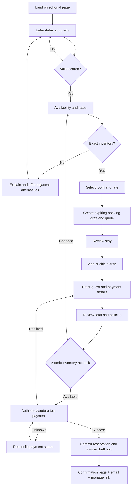
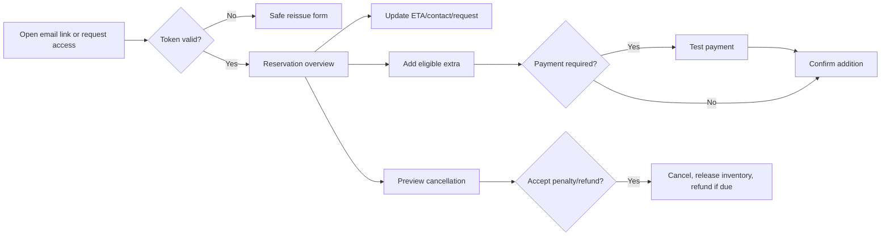
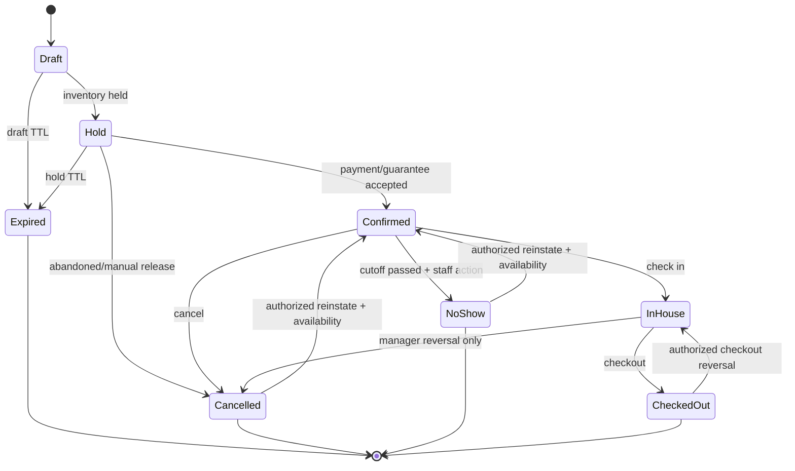
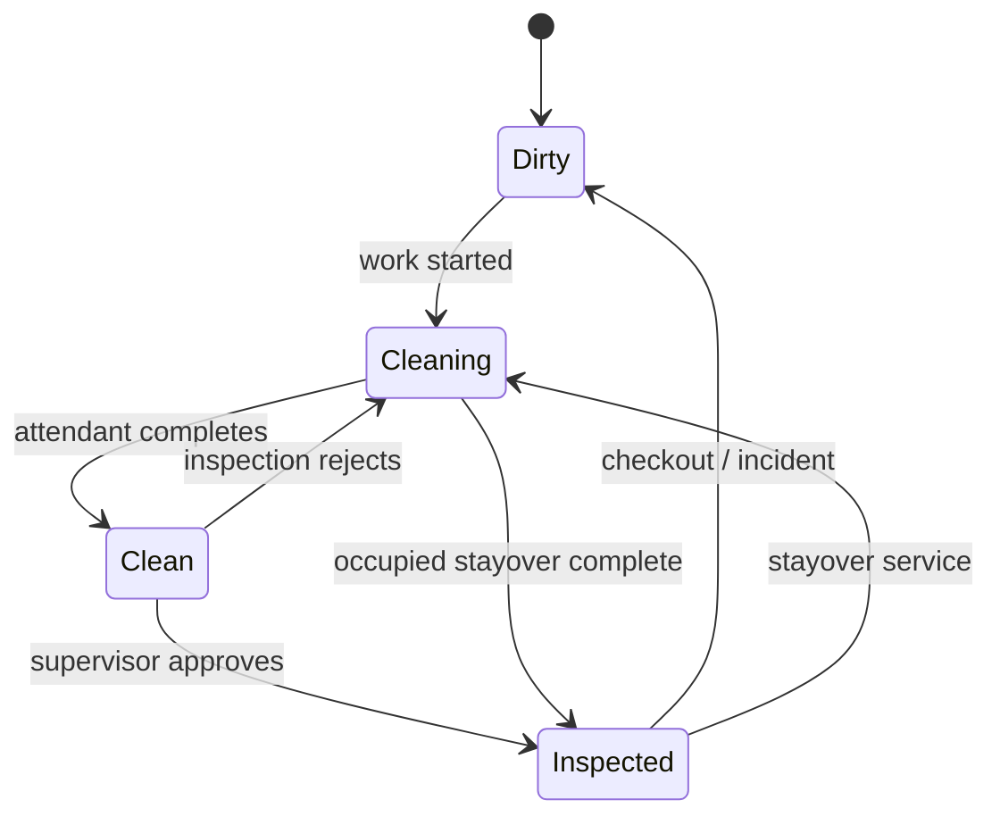
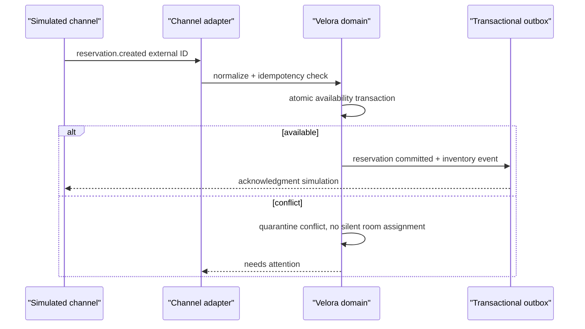

# Velora User Flows and State Machines

## 1. Guest booking lifecycle

### Search rules

1. Default party is 2 adults, 0 children, 1 room; dates are blank rather than fabricated.
2. Selecting check-in shifts focus/instruction to checkout; unavailable dates remain perceivable with reasons where possible.
3. Checkout must be after check-in; maximum stay and advance-booking limits are property configuration.
4. Results use a quote valid for 15 minutes. Expiry does not erase input; it requests reprice.
5. Availability response separates exact matches from suggestions.

### Booking draft and payment recovery

- Draft is server-side, opaque-ID, expires after 30 minutes of inactivity, and may temporarily hold only at the final payment window (recommended five minutes).
- Refresh/back restores the last completed data. A completed booking redirects all repeated submits to the same confirmation.
- A payment timeout enters `processing_unknown`; poll/reconcile provider state before allowing retry.
- If payment succeeds but confirmation write initially fails, a recovery worker completes the idempotent reservation transaction; the user sees “We are confirming your booking,” never an invitation to pay again.

## 2. Manage reservation flow

Magic links expire, can be revoked, and are scoped to one reservation. Sensitive changes require a fresh verification step. Tokens are stored hashed and removed from client logs/referrers.

## 3. Reservation state machine

| From → to | Guard | Side effects |
|---|---|---|
| Draft → Hold | quote valid; capacity | create expiring inventory hold |
| Hold → Confirmed | atomic capacity check; guarantee succeeds | reservation number, folio, confirmation, sync outbox |
| Confirmed → In house | room assigned/ready; registration and payment rules | actual arrival, room occupied, arrival task complete |
| Confirmed → Cancelled | policy preview acknowledged; permission | release inventory, penalty/refund lines, notice, channel event |
| Confirmed → No show | property cutoff; permission/reason | release future inventory, penalty, channel event |
| In house → Checked out | balance disposition; folio review | actual departure, vacant+dirty room, cleaning task, invoice/notice |
| Terminal reversal | manager permission and conflict/payment checks | compensating events, audit; never erase prior history |

Edits to dates, party, room type, assignment, or rate are attributes/events, not additional lifecycle states. “Confirmation pending” is represented by an expiring hold or external-import processing state rather than an ambiguous confirmed reservation.

## 4. Room state model

Three orthogonal dimensions prevent operational ambiguity:

### Occupancy

`vacant ↔ occupied` driven only by check-in/out or authorized reversal.

### Housekeeping condition

### Operational availability

`active ↔ out_of_service` with dated block, reason, owner, and notes. `out_of_service` affects sale; `dirty/cleaning/clean` affects readiness but not search inventory. “Do not disturb” is a temporary privacy flag on an occupied room/task, not a cleanliness state.

### Readiness derivation

- `ready_to_assign`: active and not physically overlapped.
- `ready_to_check_in`: active + vacant + inspected + assigned to arriving reservation.
- `needs_attention`: DND beyond threshold, inspection rejected, maintenance note, overdue task, or contradictory state.

## 5. Front-desk flows

### Create or edit reservation

1. Search/create guest and select stay criteria.
2. Display available room types/rates and source.
3. Select guarantee/payment behavior.
4. Optionally assign a physical room; show condition and future gaps.
5. Review price/policy/source and save through atomic availability check.
6. If another user took inventory, show changed availability and retain the draft.

### Assign or move room

1. From timeline/list/detail choose target stay.
2. System highlights physically available eligible rooms for the full interval.
3. If target type/rate differs, preview price change with `Reprice`, `Keep contracted price` (permission), or cancel.
4. Locked assignment requires explicit authorized unlock.
5. Save rechecks overlap; event stores old/new assignment, price decision, actor, and reason where overridden.

### Check in

1. Arrival worklist opens reservation summary.
2. Verify primary/staying guests, registration/contact, ETA, requests, and identity-check marker.
3. Resolve assignment and readiness; take/verify deposit or record approved payment disposition.
4. Confirm check-in. Success shows room/key marker and next useful action.
5. Failure preserves completed checks and names the unresolved guard.

### Check out

1. Departure worklist opens folio with late-charge prompt.
2. Confirm minibar/room-service postings and split/transfer if necessary.
3. Settle or record authorized ledger/waiver.
4. Confirm invoice recipient and checkout.
5. Transaction changes reservation/room/task; invoice/receipt delivery may retry asynchronously.

## 6. Housekeeping flows

### Departure clean

Checkout creates priority task → supervisor assigns → attendant starts (`dirty → cleaning`) → attendant completes (`clean`) → supervisor inspects → approve (`inspected`) or reject (`cleaning` with reason). Arrival risk escalates as check-in approaches.

### Stayover and DND

Scheduled task appears without changing occupancy → attendant records start or DND → DND task reschedules and alerts after property threshold → completion returns to inspected without marking room vacant. Privacy flag is cleared only by recorded follow-up or checkout.

### Maintenance/out-of-service

Staff reports issue → supervisor assesses → if sale/readiness affected, creates dated out-of-service block → system checks impacted reservations and opens resolution queue → repair complete → choose dirty/cleaning condition → housekeeping path restores inspected state.

## 7. Service and billing flows

### Room service

Verify room and in-house guest → create draft with price/tax snapshots → submit → kitchen accepts/prepares/marks ready → deliver with timestamp → post exactly once to open folio. Rejected/cancelled items remain in history. Post failure does not revert delivery; it creates a billing exception.

### Minibar

Select occupied/recently departed room → verify reservation/folio → choose items/quantities → preview taxes → post → inventory count decrement (demo snapshot) → correction only through void/adjustment. After checkout, late posting requires finance/front-desk authorization and may reopen payment collection without rewriting the closed invoice.

### Folio and invoice

Open folio accumulates immutable charge/payment entries → staff may split or transfer with balanced linked entries → settle balance → issue invoice from snapshot → later correction creates credit/adjustment document according to demo rules; issued record never mutates.

## 8. Simulated OTA synchronization

Outbound availability/rate/reservation events use `queued → sending → acknowledged` or `failed`; retry uses the same idempotency key. A deterministic simulator supports latency, failure, duplicate delivery, out-of-order delivery, and recovery. UI labels every channel connection and payload as simulation.

## 9. Concurrency and failure scenarios

| Scenario | Expected result |
|---|---|
| Two guests buy final room | One commits; one receives alternatives; at most one charge succeeds |
| Staff drags onto occupied interval | Preview/save rejects; original assignment remains |
| OTA duplicate webhook | Existing external record returned; no duplicate reservation/charge |
| Two staff edit reservation | Version mismatch prompts compare/reload; no silent overwrite |
| Payment success callback delayed | Processing state reconciles; retry disabled until known |
| Checkout side notification fails | checkout remains committed; outbox retries message/sync |
| Housekeeper offline update | queued locally with timestamp; conflict asks supervisor to resolve |
| Invoice PDF generation fails | immutable invoice remains issued; generation retries; reference visible |

## 10. Flow acceptance

- Each happy path and failure in this document has an end-to-end test fixture.
- State transitions not listed are rejected server-side with machine code and human-readable message.
- Each authorized override captures actor, UTC time, property, reason, previous state, and resulting state.
- Side effects that cross systems use an outbox and can be retried independently.
- All completion and failure statuses are announced to assistive technology without forced focus loss.

